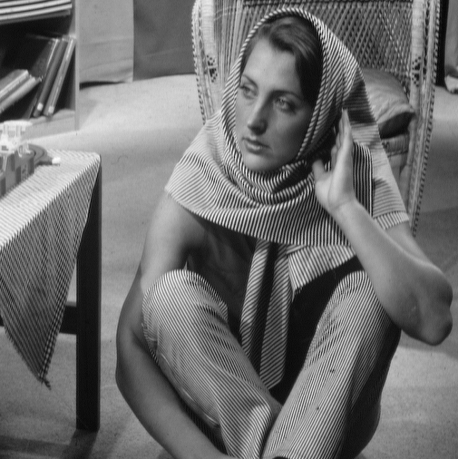
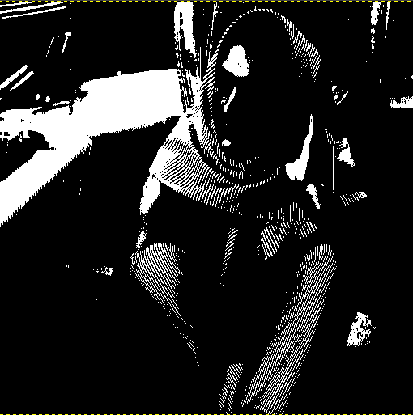
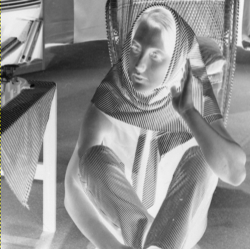
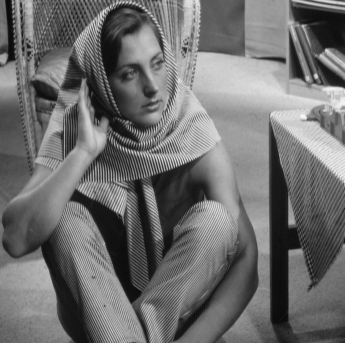

# Manipulação de listas dinâmicas e imagens

## Projeto focado na criação de uma lista dinâmica de imagens fornecidas pelo usuário, manipulação da lista dinâmica e das imagens passadas.

### About:

Esse projeto é estruturado em receber via terminal dos usuários imagens <code>.pgm</code> exclusivamente. Após receber as imagens o usuário é fornecido opções de: 

* Remover elementos da lista dinâmica
* Retornar os elementos em ordem alfabética
* Realizar o limiar da imagem
* Realizar a inversão da imagem
* Realizar o espelhamento horizontal da imagem
* Realizar o espelhamento vertical da imagem

### Como rodar o programa

Digite no terminal da pasta do projeto -> <code> gcc fuctions.c interaction.c -o manipulacao_imagens </code> 

E depois digite <code> manipulacao_imagens </code>

### Recursos

Compilador C MinGW -> [MinGW](https://sourceforge.net/projects/mingw/)

Exemplos de imagens PGM para testes -> (https://people.sc.fsu.edu/~jburkardt/data/pgma/pgma.html)

Aplicativo para a abertura das imagens <code> .pgm </code> -> [GIMP](https://www.gimp.org/downloads/)

### Outputs

Imagem original 

 </img>

Imagem Limiarizada

 </img>

-> A limiarização consiste em separar os grupos de cinza de uma imagem. Determina-se uma intensidade de cinza (limiar) que separa as partes da imagem, formando grupos de pixels com intensidades parecidas. Os valores aceitos são de 0 (iamgem totalmente branca) a 256 (imagem totalmente preta).

Imagem Invertida

 </img>

Imagem Espelhada Horizontalmente

 </img>

Imagem Espelhada Verticalmente

 </img>
